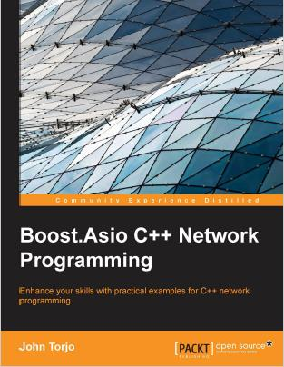

### Boost.Asio C++ Network Programming 示例代码适配到asio with c++11



#### Ubuntu16.04 asio依赖ssl
需要按照openssl及开发库
```
$ sudo apt-get install openssl 
$ sudo apt-get install libssl-dev
```

#### 参考链接
<https://legacy.gitbook.com/book/mmoaay/boost-asio-cpp-network-programming-chinese/details>
